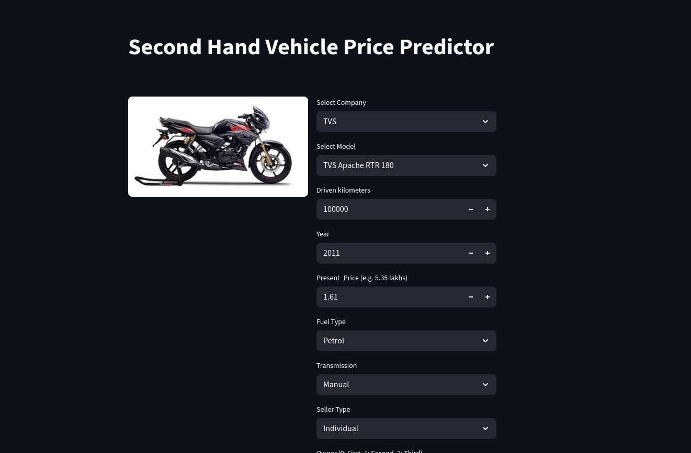

<!-- Badges -->


# 🚗 Car Price Prediction

Predict the selling price of used cars based on various features using a **Machine Learning Pipeline** with scikit-learn. Easily interact with the model through a user-friendly [Streamlit](https://streamlit.io/) web interface.

---

## 🎓 About This Project

This repository was developed as part of a data science and machine learning learning initiative, showcasing the use of data preprocessing, encoding, and regression modeling to predict car prices.

---

## 🌐 Streamlit App

**Live Demo:** [Streamlit app](https://oibsip-task3-car-price-prediction.streamlit.app/) <!-- Replace with actual URL if hosted -->

---

## 📊 Dataset

- **Source:** [`car data.csv`](car%20data.csv)
- **Features:** Year, Present Price, Kms Driven, Fuel Type, Seller Type, Transmission, Owner
- **Target:** Selling Price

---

## 🚀 Quick Start

1. **Clone this repository:**
    ```
    git clone https://github.com/yourusername/your-car-price-prediction-repo.git
    cd your-car-price-prediction-repo
    ```
2. **Install dependencies:**
    ```
    pip install -r requirements.txt
    ```
3. **Launch the app:**
    ```
    streamlit run streamlit_app.py
    ```

---

## 🧠 Highlights

- **Model:** Regression model with preprocessing pipeline
- **App:** Simple and responsive Streamlit UI in `streamlit_app.py` to predict car prices
- **Workflow:** All data analysis, preprocessing, and model training in [`notebook.ipynb`](notebook.ipynb)
- **Encoding:** Frequency encoding stored in `car_freq_map.pkl`

---

## 🖼️ Visuals


<br>


---

## 💻 Project Files

- `car data.csv`: Dataset
- `notebook.ipynb`: Data preprocessing & model development
- `pipe_model.joblib`: Saved ML pipeline (preprocessing + regression model)
- `car_freq_map.pkl`: Frequency encoding map for categorical variables
- `streamlit_app.py`: Streamlit app interface
- `requirements.txt`: Python dependencies
- (Optional) `car_features.png`, `car_image.jpg`: Project visuals

---

## 📝 License

[MIT](LICENSE)

