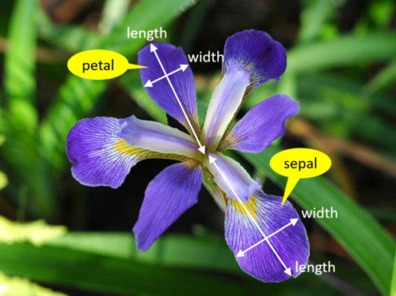
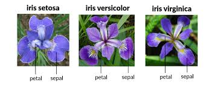

<!-- Badges -->


# 🌸 Iris Flower Classification

Classify iris species (Setosa, Versicolor, Virginica) using a **Logistic Regression** model with scikit-learn. Explore your own predictions instantly through a user-friendly [Streamlit](https://streamlit.io/) web app interface.

---

## 🎓 About This Project

This repository was developed as **Task 1** for the AICTE Oasis Infobyte Internship program, demonstrating skills in data science, machine learning, and rapid application deployment.

---

## 🌐 Streamlit App

**Live Demo:** [Streamlit app](https://oibsip-iris-flower-classification.streamlit.app/)
---

## 📊 Dataset

- **Source:** [`Iris.csv`](Iris.csv)
- **Features:** Sepal Length, Sepal Width, Petal Length, Petal Width
- **Target:** Species

---

## 🚀 Quick Start

1. **Clone this repository:**
    ```
    git clone https://github.com/yourusername/yourrepo.git
    cd yourrepo
    ```
2. **Install dependencies:**
    ```
    pip install -r requirements.txt
    ```
3. **Launch the app:**
    ```
    streamlit run app.py
    ```

---

## 🧠 Highlights

- **Model:** Multi-class classification using Logistic Regression
- **App:** Easy-to-use Streamlit interface in `app.py` to predict species from measurements
- **Workflow:** All data analysis, training, and evaluation in [`classification.ipynb`](classification.ipynb)

---

## 🖼️ Visuals


<br>


---

## 💻 Project Files

- `Iris.csv`: Dataset
- `classification.ipynb`: Data analysis & model development
- `iris_model.pkl`: Saved Logistic Regression model
- `app.py`: Streamlit app
- `requirements.txt`: Dependencies
- `features.png`, `iris_flower.jpeg`: Project images

---

## 📝 License

[MIT](LICENSE)

